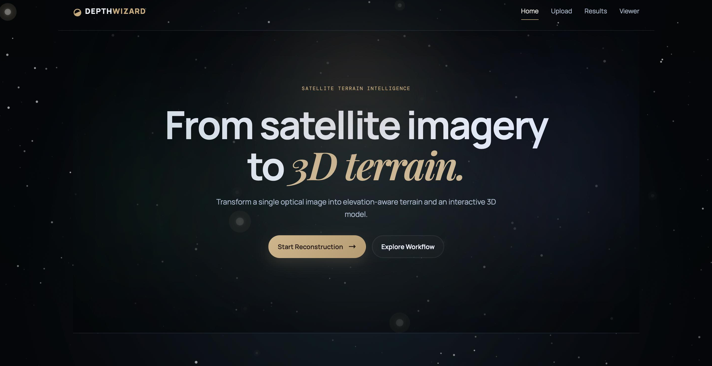
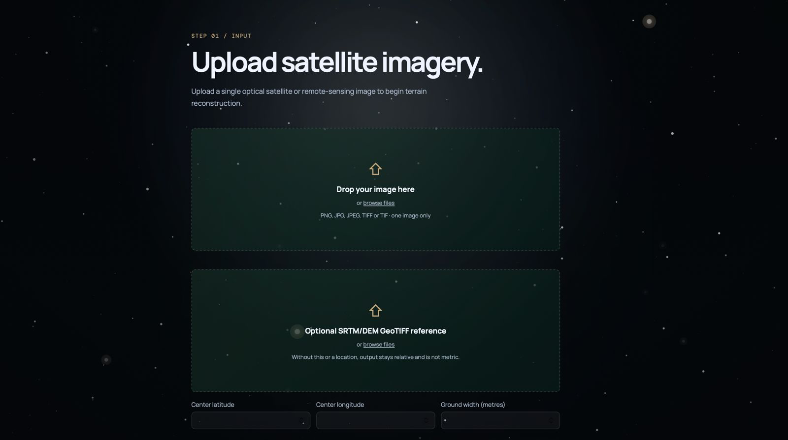
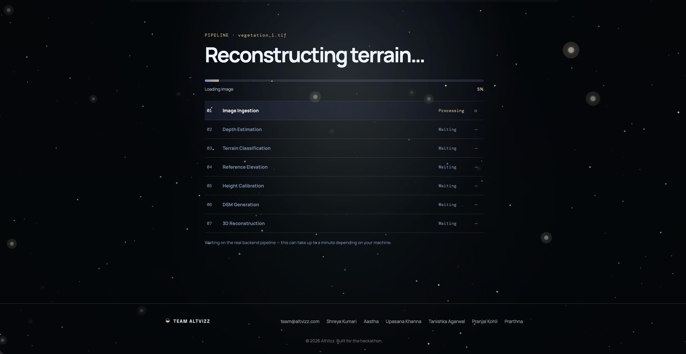
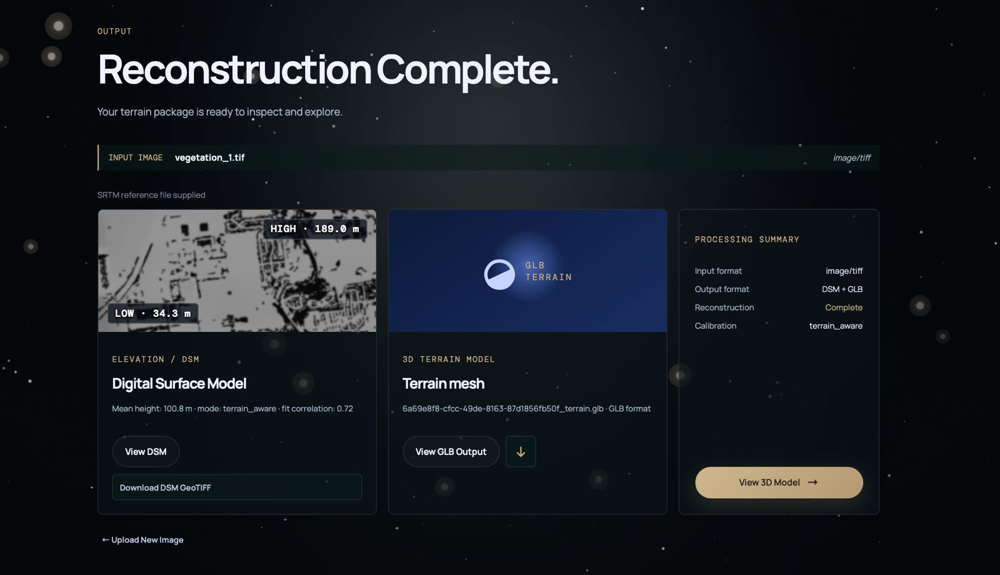
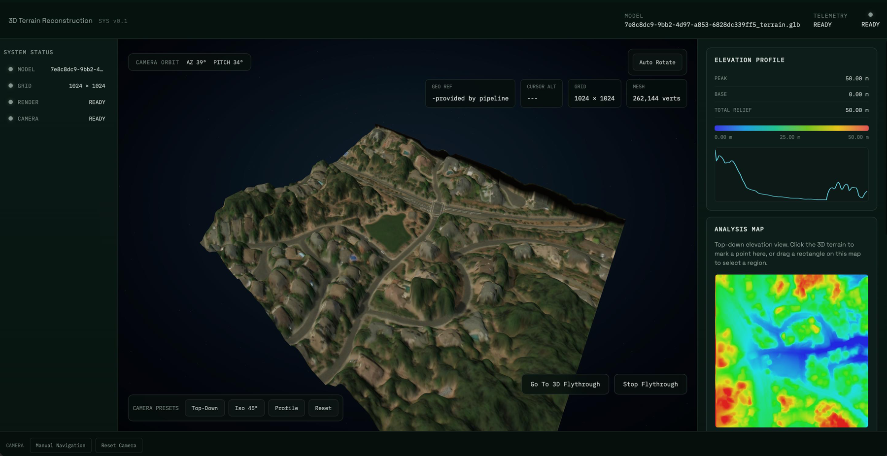

# DepthWizard

### Single-View Height Estimation and 3D Flythrough

*Terrain-aware reconstruction and interactive 3D terrain analysis from a single optical image.*

 

 

**Team AltVizz** (Team ID 167420) · Smart India Hackathon 2026 · Problem Statement 26175 · Organization: ISRO, Department of Space

---

## Table of Contents

1. Overview
2. Key Features
3. How It Works
4. Results
5. Screenshots
6. Tech Stack
7. Installation
8. Usage
9. Disaster Management Use Case
10. Applications and Integration
11. Limitations
12. Future Scope
13. Team
14. References

---

## Overview

Accurate Digital Surface Models (DSMs) are fundamental to urban planning, disaster management and reconnaissance. Traditional sources (stereo imaging, LiDAR, InSAR) are costly, depend on specific sensors and need heavy computation. Single-image height estimation is a fast, low-cost alternative, but it comes with real problems:

- **Depth ambiguity.** A single RGB image gives relative depth, not measurable real-world heights.
- **Domain gap.** Foundation depth models are trained mostly on natural, ground-level images, not overhead remote-sensing imagery.
- **Terrain-dependent errors.** Buildings, vegetation, shadows, bare ground and slopes distort depth differently, so one global scale cannot correct them.
- **No absolute scale.** Converting relative depth into trustworthy elevation needs an external reference such as SRTM.

**DepthWizard** is an end-to-end software pipeline that takes a single aerial or satellite image and produces an elevation map, a textured 3D terrain mesh and an interactive browser-based flythrough. It treats depth inference, geospatial referencing, calibration, geometry generation, visualization and validation as separate, inspectable stages, so errors can be traced to where they originate.
DepthWizard supports two output modes:

| **Input**                              | **Output**                                               |
| -------------------------------------- | -------------------------------------------------------- |
| **PNG / JPG** (no spatial metadata)    | **Relative DSM (rDSM)**, used directly for visualization |
| **GeoTIFF** (with coordinate metadata) | **Calibrated DSM**, aligned to SRTM reference elevation  |

> **Scope.** DepthWizard is a decision-support and visualization aid. It does not replace surveyed elevation products, LiDAR, photogrammetry or geodetic measurements where those are required. Non-georeferenced inputs give relative heights only, and metric elevation is not implied without a validated geospatial reference.

---

## Key Features

- **Domain-adapted depth estimation.** Depth Anything V2 fine-tuned on GAMUS (overhead RGB paired with height ground truth) to narrow the natural-image to remote-sensing domain gap.
- **Terrain-aware segmentation.** Separates buildings, vegetation, shadows, bare ground and slopes so each class can be handled on its own terms.
- **Adaptive, per-class calibration.** A degree-2 polynomial fit per terrain class rather than one global scale, with a global fallback for classes lacking enough reference pixels.
- **Georeferenced elevation mapping.** Bounds are derived automatically from GeoTIFF metadata, and SRTM reference elevation is aligned to the image grid.
- **Confidence-guided elevation.** Highlights regions where height estimates may be unreliable (shadows, vegetation, terrain variation).
- **Artifact-aware geometry.** NoData masking, planar-tilt detrending and boundary handling prevent numerical artifacts from becoming physical geometry.
- **Interactive 3D viewer.** Three.js / React Three Fiber terrain viewer with elevation profile, slope heatmap, hillshade, wireframe and click-to-inspect.
- **Pre vs post comparison.** Paired-image workflow for disaster assessment, with an independent spatial-alignment check.
- **Independent validation.** MAE, RMSE and Pearson correlation, run through a separate validation path.

---

## How It Works

RGB Image
   │
   ▼
Image Ingestion ──► metadata check: PNG/JPG → rDSM path | GeoTIFF → geospatial path
   │
   ▼
Depth / Height Estimation   (GAMUS fine-tuned Depth Anything V2)
   │
   ▼
Terrain Classification      (buildings, vegetation, shadows, bare ground, slopes)
   │
   ▼
SRTM Integration            (bounds from GeoTIFF metadata → aligned reference elevation)
   │
   ▼
Adaptive Calibration        (per-class polynomial fit, spike cleanup)
   │
   ▼
Elevation Grid ──► Geometry Cleaning ──► 3D Mesh (GLTF / GLB)
   │
   ▼
WebGL Viewer ──► Height & Slope Analysis ──► Validation

| **Stage**              | **Input**                | **Output**               | **Purpose**                                     |
| ---------------------- | ------------------------ | ------------------------ | ----------------------------------------------- |
| Image ingestion        | PNG / JPG / GeoTIFF      | Image + metadata         | Establish input type and spatial context        |
| Depth estimation       | RGB image                | Predicted height / depth | Recover scene structure from one view           |
| Terrain classification | RGB / depth cues         | Terrain masks            | Separate regions with different error behaviour |
| SRTM integration       | Georeferenced bounds     | Reference elevation      | External geospatial anchor                      |
| Adaptive calibration   | Depth + reference + mask | Calibrated DSM           | Convert relative structure into elevation       |
| Mesh generation        | Elevation grid           | 3D mesh                  | Build inspectable terrain geometry              |
| Interactive analysis   | Mesh + derived metrics   | WebGL view               | Explore terrain, profiles and slopes            |

### Depth Estimation

The model is trained directly against overhead RGB imagery paired with height (nDSM) targets, so its output already represents learned height information rather than a generic normalized depth map. Training uses a combined height loss: pixel-level height error plus a gradient loss, so absolute heights and the transitions between neighbouring regions are learned together.

### Calibration

For each terrain class *c* with enough valid reference pixels:
h(x) = a_c · d(x)² + b_c · d(x) + c_c

Classes without enough valid reference pixels fall back to a single global polynomial fit. Without a terrain mask, one global fit is used. After calibration, isolated elevation spikes are compared with their local median and replaced when they exceed a threshold. When a reference is available, mean error, maximum error and correlation against it are stored in the output metadata.

### Geometry Engineering

Validation exposed several issues that were diagnosed at their source rather than treated as visual noise:

| **Issue**                            | **Diagnosis**                                           | **Fix**                                      | **Verified outcome**   |
| ------------------------------------ | ------------------------------------------------------- | -------------------------------------------- | ---------------------- |
| Artificial ridge across a flat scene | Systematic planar component in the calibrated surface   | First-order 2D polynomial surface detrending | \~74 m → \~0 m         |
| Vertical mesh spikes                 | SRTM NoData (`-9999`) entering calibration and geometry | NoData masking + boundary interpolation      | Extreme spikes removed |
| DSM edge discontinuity               | Window / filter boundary effects                        | 5-pixel boundary crop + edge clamping        | Edge artifact reduced  |

---

## Results

Two separate evaluations are reported. They measure different things and should not be conflated.

### 1. Model fine-tuning: vanilla vs GAMUS fine-tuned

Held-out evaluation on **300 GAMUS test tiles** (0 skipped), `vits` encoder. Values are per-image means, with per-image medians in parentheses.

| **Protocol**              | **MAE (m)**       | **RMSE (m)**      | **Pearson**       |
| ------------------------- | ----------------- | ----------------- | ----------------- |
| Vanilla, raw output\*     | 4.001 (2.785)     | 5.804 (4.175)     | 0.475 (0.525)     |
| Vanilla, aligned to GT    | 3.056 (2.518)     | 4.058 (3.183)     | 0.490 (0.525)     |
| Fine-tuned, raw output    | **2.909** (2.285) | 4.518 (3.595)     | 0.622 (0.630)     |
| Fine-tuned, aligned to GT | **2.542** (2.234) | **3.644** (3.075) | **0.623** (0.630) |

\*The vanilla raw output is disparity, not metres, so its MAE / RMSE are not directly comparable in absolute terms. It is included to show the unaligned starting point.
**Headline (both models aligned to ground truth):**

| **Metric** | **Vanilla** | **Fine-tuned** | **Change** |
| ---------- | ----------- | -------------- | ---------- |
| MAE        | 3.06 m      | 2.54 m         | **−16.8%** |
| RMSE       | 4.06 m      | 3.64 m         | **−10.2%** |
| Pearson    | 0.490       | 0.623          | **+0.133** |

> **Which number to quote.** The aligned protocol fits a per-image scale and shift to ground truth, which cannot be done at real inference time. The **fine-tuned raw-output MAE of 2.91 m** is the fairest single measure of unassisted absolute accuracy. The aligned rows separate structural (ordering / correlation) improvement from absolute-scale improvement.

**Diagnostics.** 14 of 300 vanilla tiles produced a negative Pearson correlation (the pretrained model's depth ordering was inverted relative to elevation on those scenes). For the fine-tuned model, the fitted scale has a median of 0.785 (mean 0.871) and the fitted shift a median of 0.581 m, close enough to identity to indicate the raw output is already reasonably near metric scale.

### 2. Full calibrated pipeline vs SRTM reference

Reported on the project's own test regions after terrain-aware calibration:

| **Terrain**         | **MAE (m)** | **Pearson** |
| ------------------- | ----------- | ----------- |
| Urban / buildings   | 2.54        | 0.497       |
| Vegetation / forest | 3.12        | 0.461       |
| Bare terrain / flat | 1.89        | 0.206       |

The reported correlation range across evaluated land-cover conditions is **0.13–0.50**. Bare terrain shows lower correlation, which the project attributes to weaker texture and fewer high-frequency cues for a monocular model. These are measured results on the evaluated conditions, not universal accuracy guarantees.

### Engineering validation

| **Check**                                                  | **Result**                                          |
| ---------------------------------------------------------- | --------------------------------------------------- |
| Artificial planar ridge after detrending                   | \~74 m → \~0 m                                      |
| Dynamic bounds vs manual coordinate lookup (verified case) | 100% match                                          |
| SRTM NoData (`-9999`) propagation                          | Identified and masked                               |
| Edge NoData artifacts                                      | 0.68%–1.17% of boundary pixels, detected and masked |
| xBD disaster pairs, spatial alignment                      | 5 of 5 pairs: IoU = 1.0, resolution ratio = 1.0×    |

---

## Tech Stack

| **Layer**          | **Technology**                       | **Role**                                                    |
| ------------------ | ------------------------------------ | ----------------------------------------------------------- |
| Deep learning      | PyTorch                              | Model execution and inference                               |
| Depth model        | Depth Anything V2 (GAMUS fine-tuned) | Height / depth estimation                                   |
| Image and numerics | OpenCV, NumPy, SciPy, Matplotlib     | Image operations, arrays, filtering                         |
| Geospatial         | Rasterio, GDAL, GeoTIFF, SRTM        | CRS handling, bounds, raster alignment, reference elevation |
| 3D geometry        | Trimesh                              | Grid-to-mesh conversion and export                          |
| Backend            | FastAPI, Uvicorn                     | Pipeline and API orchestration                              |
| Frontend           | Next.js, React, Tailwind CSS         | Application shell and UI                                    |
| 3D rendering       | Three.js, React Three Fiber, WebGL   | Interactive terrain visualization                           |

---

## Installation

### Prerequisites

- Python 3.10+
- PyTorch 2.0+ (with CUDA support recommended)
- Node.js 18+ and npm

### 1. Clone the repository

git clone https\://github.com/altvizz-sih26/AltVizz.git
cd AltVizz

### 2. Python environment

python -m venv venv

\# Windows
venv\Scripts\activate

\# macOS / Linux
source venv/bin/activate

pip install -r requirements.txt

### 3. Model checkpoint

\<!-- TODO: state where the fine-tuned checkpoint is hosted and where to place it. -->
Download the fine-tuned checkpoint from `YOUR_CHECKPOINT_URL` and place it at `YOUR_CHECKPOINT_PATH`.

### 4. Start the backend

uvicorn backend.main\:app --reload --port 8000

### 5. Start the frontend

npm install
npm run dev

Then open the URL printed by the dev server (typically `http://localhost:3000`).

---

## Usage

### Web application

1. Open the app and choose a workflow: **Single Image Reconstruction** or **Disaster Assessment**.
2. Upload a PNG, JPG or GeoTIFF image.
3. Watch pipeline progress (depth inference → classification → geospatial processing → calibration → mesh).
4. Explore the result in the 3D viewer and download outputs (GLB mesh, DSM, metrics).

### Viewer tools

| **Tool**          | **What it shows**                                                      |
| ----------------- | ---------------------------------------------------------------------- |
| Elevation Profile | Peak, base and total relief along a selected transect                  |
| Slope Heatmap     | Spatial distribution of slope gradients                                |
| Hillshade         | Relief-oriented shading for surface form                               |
| Wireframe         | Underlying mesh structure and quality                                  |
| Click-to-Inspect  | Height, relative depth, slope, terrain class and confidence at a point |

### Command-line scripts

| **Script**                    | **Purpose**                                                                                                        |
| ----------------------------- | ------------------------------------------------------------------------------------------------------------------ |
| process_new_image.py          | Unified entry point for processing a new image (relative-DSM route for PNG/JPG, SRTM-calibrated route for GeoTIFF) |
| validate_spatial_alignment.py | Checks footprint overlap (IoU) and pixel-scale compatibility of an image pair before comparison                    |
| run_full_validation.py        | Runs the independent evaluation path (MAE, RMSE, Pearson)                                                          |

\<!-- TODO: add example invocations with real arguments, e.g. python process_new_image.py --input \<path> -->

### Input modes

| **Input** | **Behaviour**                                                                                               |
| --------- | ----------------------------------------------------------------------------------------------------------- |
| PNG / JPG | Produces a **relative DSM**. Heights are relative and not guaranteed metric.                                |
| GeoTIFF   | Bounds are read from metadata, SRTM reference is fetched and aligned, and a **calibrated DSM** is produced. |

---

## Disaster Management Use Case

DepthWizard includes a **before / after comparison** workflow for post-event visualization and terrain / structural change assessment. Two images are aligned to the same spatial frame, and their DSMs and 3D terrain can be compared, for example pre-disaster against post-disaster.
The workflow was evaluated on **five real disaster-image pairs** from the xBD / xView2 dataset, covering flood, earthquake, fire, tsunami and hurricane scenes. All five passed the spatial-alignment check (IoU = 1.0, resolution ratio = 1.0×).

> DepthWizard does **not** predict earthquakes or other hazards. It supports image-based assessment after an event. Passing the alignment check does not by itself establish damage-detection or elevation-change accuracy.

---

## Applications and Integration

- **Disaster management:** pre / post-event change assessment for floods, landslides and earthquake damage.
- **Urban planning:** building heights and terrain models for zoning, growth tracking and construction monitoring.
- **Defence and reconnaissance:** rapid terrain and structure understanding from a single image.
- **Environment and land use:** vegetation change and encroachment detection.
- **Infrastructure and mining:** excavation and cut / fill change tracking.

**Fitting into existing workflows.** DepthWizard works from imagery that is already available (PNG, JPG, GeoTIFF from satellites, aerial surveys or drones), needs no new sensors, uses free SRTM data as a reference, and delivers GeoTIFF outputs and GLTF meshes. Its modular FastAPI backend and browser viewer let each stage be inspected, replaced or connected independently.

---

## Limitations

The current evidence has clear boundaries:

| **Limitation**            | **Implication**                                                                                                                                                                                                                             |
| ------------------------- | ------------------------------------------------------------------------------------------------------------------------------------------------------------------------------------------------------------------------------------------- |
| GCP integration           | The design supports Ground Control Points, but manual GCP alignment is not fully integrated into the automated workflow. SRTM is the implemented reference.                                                                                 |
| Steep / hilly terrain     | Extreme mountain relief has not been sufficiently validated against high-resolution reference data.                                                                                                                                         |
| Domain gap                | Fine-tuning improved correlation (0.49 → 0.62) but did not eliminate the gap. Correlation remains below the 0.7–0.9 range associated with strong monocular height models. Unusual lighting or sparse features can still reduce reliability. |
| Non-georeferenced inputs  | PNG / JPG give relative heights only.                                                                                                                                                                                                       |
| Disaster comparison scope | Spatial alignment is verified for the evaluated pairs, which does not by itself establish universal damage-detection accuracy.                                                                                                              |
| Encoder size              | Fine-tuning used the `vits` encoder only.                                                                                                                                                                                                   |

---

## Future Scope

- Scale fine-tuning to larger encoders (`vitb` / `vitl`) and a larger training subset.
- Automated GCP integration for stronger metric anchoring.
- Validation on steep and mountainous terrain with appropriate reference products.
- Expanded validation across geography, season, sensor and terrain type.
- Stronger, more explicit uncertainty reporting.

---

## Team

**Team AltVizz**, Smart India Hackathon 2026

| **Member**       | **Responsibility**                           |
| ---------------- | -------------------------------------------- |
| Tanishka Agarwal | Depth Estimation & Terrain Classification    |
| Aastha Ananya    | Depth-to-Elevation Calibration               |
| Upasana Khanna   | 3D Mesh Generation & Geometry Engine         |
| Prarthna         | Interactive 3D Visualization & Analytics     |
| Shreya Kumari    | Geospatial Data & SRTM Integration           |
| Pranjal Kohli    | Backend Orchestration & Pipeline Integration |

---

## References

- [Depth Anything V2](https://github.com/DepthAnything/Depth-Anything-V2): monocular depth estimation backbone
- [GAMUS dataset](https://huggingface.co/datasets/earthflow/GAMUS): aerial imagery paired with height ground truth
- [IM2ELEVATION: Building Height Estimation from Single-View Aerial Imagery](https://www.mdpi.com/2072-4292/12/17/2719)
- [xView2 / xBD](https://xview2.org/): pre / post-disaster imagery dataset
- [SIH2026 reference dataset](https://github.com/IMG-PROCESS-SAC/SIH2026/)
- SRTM: [OpenTopography](https://opentopography.org/), [dataset DOI](https://doi.org/10.5067/MEaSUREs/SRTM/SRTMGL1_NC.003), and Farr, T.G., et al. (2007), *The Shuttle Radar Topography Mission*, Reviews of Geophysics, 45, RG2004 ([doi](https://doi.org/10.1029/2005RG000183))
- [Rasterio](https://rasterio.readthedocs.io/) · [Rasterio GitHub](https://github.com/rasterio/rasterio) · [GDAL](https://gdal.org/)
- [Three.js](https://threejs.org/) · [React Three Fiber](https://docs.pmnd.rs/react-three-fiber)

---

\
\<b>DepthWizard\</b> · Team AltVizz · Smart India Hackathon 2026\

